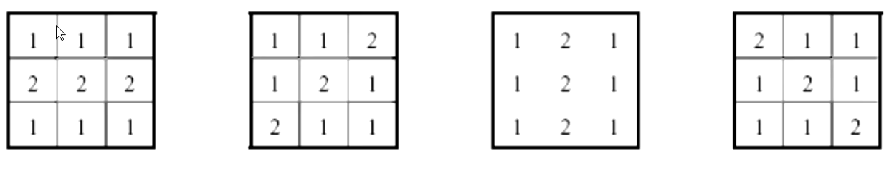

# 图像处理 22年春

>   $a,b \quad ; \quad c$ 

**JPEG**的核心技术上是人眼对高频信息不敏感

**图像变换的基本原则**：能量守恒，但是能量重新分配（不增加新的信息，不改变原有信息，不影响分辨率和直方图？？？）

## Chapter 1 ： 概述

### 数字图像与模拟图像的区别 **第一题**

> 数字图像和模拟图像的区别就是，数字图像是由离散的像素点构成的一个**二维光量矩阵**，可以进行锐化等处理，而模拟图像是连续的

### 图像处理的应用 **最后一题**

> **伪彩色图像处理**；遥感测绘；导航；人脸识别；虹膜识别；三维重建；图像的标记和识别；**光度立体视觉**；荧光石油探测

### 图像经过函数变成什么样子

> 变亮；变暗；反色
> 对比度减弱；对比度增强；对比度减弱，变亮 (这一行我猜的) 

### 图像直方图，直方图均衡化，归一化

> (**期末考题填表**) 均衡化（见4.2）后信息丢失，效果更好

## Chapter 2 : 图像和视觉基础

### 人眼的特性

> 400-800nm的电磁波
> 对**黄绿色最灵敏**（暗对绿更敏感，亮对黄更敏感）；对白光较灵敏；红蓝紫不灵敏（雨天交警的衣服）
> **对彩色比对黑白敏感**
> 人眼的适应性亮度范围很大（通过调整瞳孔大小实现）
> **视觉惰性：视觉暂留**（显示器）
> 同时对比度：人感知亮度不仅依赖于强度，还依    赖于背景
> 马赫效应
> 对颜色是带通滤波

### 根据人眼的特性应用设计

> **看上?**

### 马赫效应

> 人眼对高频不敏感；不同的灰度边缘，具有边缘效应，即过渡带（图像的边沿蕴含大量的信息）

### RGB模型

> 红绿蓝表示各**8bit**(0-255)
> 灰度是RGB模型的**对角线**

HIS：亮度，色调，饱和度

### 流程图应用

> 图像融合（将低分辨率的图像中的亮度`I`通过高分辨率图像的亮度`I`进行匹配替换，融合图像，提高分辨率）

### 成像模型 （给出例子写出模型的积分公式）

简单模型：

$$ f(x,y)=i(x,y)\cdot r(x,y)\quad 
\begin{array}{ll}
    0<i(x,y)<\infty & 入射光量（照度） \\
    0<r(x,y)<1 & 反射
\end{array} $$

复杂模型：

往年题目(**见Chapter 6**)：

#### !!! 传感器模型

$$I_k = \int R(\lambda)E(\lambda)S(\lambda) \quad k \in \lbrace R,G,B \rbrace$$

$$R 色彩通道增益 \quad E 入射的辐照度 \quad S反射系数$$

### 采样 量化 分辨率

模拟信号到数字信号的过程

>   采样是将空间中的连续图像转化为离散的像素点（空间分辨率：像素点的个数 过低：棋盘状效应）
>
>   量化是将连续的浓淡值转换为离散的数值的过程（辐射【量化】分辨率：灰度级，量化阶级 过低：假轮廓）

-   时-频分辨率不能同时最佳
-   硬件能量转化器的性能限制

### 图像的运算

>   图像相当于集合`and(与), or(或), not(非), xor(异或)`

## Chapter 3 ： 辐射、光照和阴影

### 透视收缩公式理解

#### 立体角

$$\omega = a = \frac{A}{R^2}(steradians)$$

#### 定义

-   光通量(w)$\quad\Phi$
-   光强(单位立体角)$\quad I = \frac{d\Phi}{d\omega}$
-   辐照度(单位面积)$\quad E = \frac{d\Phi}{dA}$
-   辐亮度(每单位面积单位立体角)$\quad L = \frac{d^2\Phi}{d\omega dA}$

#### 透视收缩

$$I 光强 \quad r 点到光源的距离 \quad \theta 法向量与光线的夹角$$

**基于光源方向的应用**：光度立体视觉；光度距离测量；识别虚假图片（P图识别）

### 光度立体视觉

>   重建物体三维图像；照相机不动，改变光源的方向

### 光源的估计和修正（目的）

>   颜色识别物体困难，基于颜色的物体识别和提取，需要把物体的光谱和光源的光谱分开（去除白光）

`GrayWorld`模型：

$$E_k=\lbrack \frac{1}{N}\sum_j I^p_{k,j}\rbrack ^{\frac{1}{p}}\quad k \in \lbrace R,G,B \rbrace$$

## Chapter 4 ：图像增强

>   **判断题**：图像经过处理后信息减少，则不是图像增强（**×**）

### 对比度处理法 **今年期末考**

>   使`ab`段的对比度增强，使对比度更加鲜明；反色；灰度切分

### !!! 直方图处理

>   灰度直方图：灰度的一阶概率统计（不包含空间信息）

#### 直方图均衡化

使得直方图分布变成均匀分布$\quad p(r_k)=\frac{n_k}{n}$

则，增强函数$\quad s_k = T(r_k) = \sum^{k}_{i=0}\frac{n_i}{n}=\sum^{k}_{i=0}p(r_i)$

| 运算                                              | 公式                    |
| ------------------------------------------------- | ----------------------- |
| 原图的$p(r_k)$                                    | $\frac{n_k}{n}$         |
| $s_k$                                             | 前面的$p(r_k)$累加`cdf` |
| 计算均匀分布每个灰度级的`cdf`                     | $\frac{k}{n}$           |
| 将原图的$p(r_k)$搬到最接近的均匀分布的`cdf`再累加 | $-$                     |

#### 直方图规定化

>   将均衡化中的均匀分布的`cdf`改成期望分布的概率计算所得的`cdf`

### 模板对图像处理的效果（空域）

-   **平滑**：去除不重要的细节，滤除噪声；积分操作
-   **锐化**：增强被模糊的细节；微分操作

#### 线性平滑滤波

>   模板增强了那个方向的信息

#### 锐化

>    模板锐化的哪个方向

**图像过模板后信息会丢失（大概）**

### 伪彩色增强

$$f(x,y)= \begin{cases} I_R(x,y) \\ I_G(x,y) \\ I_B(x,y) \end{cases}$$

>   将感兴趣的部分用色彩标记出来

## Chapter 5 ：形态学处理

先阈值化（大津法），再形态学操作（集合运算）

-   膨胀：模板里的像素有一个非`0`，就全部赋值为`1`
-   腐蚀：模板里的像素有一个为`0`，则全部赋值为`0`

>   不是逆操作

### 开操作

先腐蚀再膨胀：保持大体形状的前提下，去除细微边界

### 关操作

先膨胀再腐蚀：保持大体形状的前提下，填充缺口

### 均值滤波

#### 中值滤波模板

用模板中对应的平均值替代整个模板中的像素点的数值

>   卷积核：对图像中含有卷积核特征的信息进行提取

#### 平滑滤波

>   均值；高斯滤波

### Laplace算子

>   数值大的区域就是边缘区域（边缘变化较快）

### 边缘检测（效果）

#### `Sobel`算子

#### `Canny`算子

>   平滑的程度会影响边缘提取的结果

1.   先高斯平滑
2.   再通过`Sobel`算子
3.   抑制非沿梯度方向变化的边界
4.   保留强的以及连通的边界

**应用**：颗粒测度

## Chapter 6 ：图像的恢复

### 图像降质的因素

-   大气降低传输质量（**低SNR**）
-   传感器（CCD）非线性
-   AD混叠

### 图像恢复和图像增强的异同点

#### 相同点

-   图像增强和图像恢复都是改善图像的质量

#### 不同点

-   图像恢复是利用退化过程的先验知识，通过建立退化模型，再使用退化模型的逆操作恢复图像。而图像增强则不寻找降质原因。
-   图像恢复是针对图像整体，改善图像整体质量；图像增强针对局部，改善图像的局部特征
-   图像恢复利用图像退化的过程恢复图像，是客观过程，具有客观的评判标准；图像增强是为了使得图片适应人眼的特征，是主观过程，缺乏客观的评判标准
-   图像恢复是逆过程，图像增强是正过程

### 线性退化模型（时不变）

大气湍流模型：$H(u, v) = e^{-k(u^2+v^2)^{\frac{5}{6}}}$

### 有约束和无约束（对退化模型进行约束的原因）

#### 无约束恢复

逆滤波，在没有噪声先验知识的情况下，找到对`f(x,y)`的估计，受噪声影响很大

#### 有约束恢复

维纳滤波，寻找估值使得其与原图之间的均方估值最小，综合考虑了退化函数和噪声统计特征，对噪声可以自动抑制

**上课的时候说会考推导？？？**

*少了平方*

## Chapter 7 ：目标检测

### 霍夫变化（给出图 指出问题）

-   降维：将线对应成点$(\rho,\phi)$

对每一个点在$(\rho,\phi)$空间进行遍历，绘制每一个点的$(\rho,\phi)$空间的交集（Voting）

**增加方向**：通过边缘的梯度值选择线的方向

#### 优点

-   所有点都是独立处理的，因此可以处理遮挡、间隙 
-   对噪声具有一定的鲁棒性：噪声点不太可能始终对任何单个 bin 做出贡献 
-   可以在一次通过中检测模型的多个实例 

#### 缺点

-   计算量大，计算难度指数级上升
-   非目标形状会在参数空间中产生虚假峰值 
-   参数量化：可能很难选择良好的网格大小

>   计算时间长，降维/提前固定位置

### RANSAC

1.   随机选取两个点
2.   计算线
3.   计算误差函数
4.   统计误差在一定范围内的点
5.   重复

>   最后在一群点里可以使用最小二乘法

#### 优点

-   适用于多种模型
-   易于实现且易于计算错误率
-   在较低的开销下，可以处理更高的维度

#### 缺点

-   对噪声容忍度非常的低
-   阈值的定义有一定困难

### 特征点

角点（在各点变化剧烈）的选择算法：Harris Corner Points；FAST算法

特征的描述：SIFT（尺度不变的点）；SURF；ORB

**Harris算法**：在微小扰动下，变化幅度较大，此时就认为是特征点

-   旋转变化时，特征点不变；但大小改变时，特征点改变

>   通过不同的高斯平滑（相当于尺度变化）后求差；再选取特征点就可以得到尺度不变的特征点

**SIFT**：以角度作为描述，对本身像素点没有要求

**SURF**

## Chapter 8：摄影立体几何

>   此节回放丢失

$(u,v)相平面(由于反转，有些使用倒置坐标)\quad F小孔到相平面的距离 \quad Z_c垂直于相平面$

则定义参数（焦距）：

考虑相机坐标系和真实世界坐标系之间的关系，**方向余弦矩阵**：

再考虑相机模型：

$C_{\omega}^c 方向余弦矩阵 \quad X_{c\omega}^W相机的相对位置$

则可以得到相机的模型：

$$\begin{pmatrix} u \\ v \\ 1 \end{pmatrix} \cdot Z^c = \begin{pmatrix} f_x & 0 & u_0 & 0 \\ 0 & f_y & v_0 & 0 \\ 0 & 0 & 1 & 0 \end{pmatrix}\cdot \begin{pmatrix} R & t \\ 0 & 0 \end{pmatrix} \cdot \begin{pmatrix} X^W \\ Y^W \\ Z^W \\ 1 \end{pmatrix}$$

相机的内参：

$$\begin{pmatrix} f_x & 0 & u_0 & 0 \\ 0 &  f_y & v_0 & 0 \\ 0 & 0 & 1 & 0 \end{pmatrix}$$

相机的外参：

$$\begin{pmatrix} R & t \\ 0 & 0 \end{pmatrix}$$

### 应用

-   立体视觉：通过相机得到物体的三维信息
-   几何标定：通过已知的三维信息得到相机的相对位置

## Chapter 9 ：图像切割

### 人类理解图像和计算机理解图像的区别

-   人类理解图像是自顶而下的，直接从整体图像中提取特征。
-   计算机理解图像是自下而上的，通过相似性，查找像素组和图像区域达到分割图像，特征提取的目的。

### 主观轮廓算法

$\alpha 表示弹力 \quad \beta 表示刚度 \quad \gamma 表示外部参数的权值$

### 监督学习和非监督学习

监督学习有训练集，具有标定好的数据集，有预期的输出。而无监督学习没有预期的输出。

### K-Means算法

1.   给定一个K值，即希望得到几个聚类
2.   随机选择K个数据点作为质心
3.   计算每个数据点离质心的距离，依据最小距离分类
4.   分好类后通过数据均值计算出新的质心
5.   如果新的质心和旧的质心的距离小于阈值就停止，否则重复

#### 优点

-   简单快速

#### 缺点

-   需要预先知道聚类数量K
-   对初始点可能会更敏感
-   对不擅长发现非球形的特征

### Mean-Shift算法

### 流程

1.   从局部搜索窗口中寻找密度最大的值
2.   将窗口移动到均值
3.   重复，直到收敛

#### 改进

-   不需要预先知道聚类的数量
-   可以发现非球形特征

## Chapter 10 ：机器学习

### 什么是机器学习

通过经验提高计算机程序的性能

### 机器学习模型的类别

-   监督和非监督：是否具有预期的输出值（标定好的数据集）
-   生成和辨别：生成是产生类似输入的输出，判别是给出输入的概率
-   分类和回归：输入是离散的还是连续的

### 机器学习的改善

**KNN**：用多数表决进行分类

-   使用相邻点的个数
-   距离的定义方式
-   权重的选择

**SVM**：调整核函数

**Decision Tree**：分支的广度和深度

### 融合和Boosting

**融合**：不同的模型对不同的数据点有更好的表现，融合是将多个模型组合在一起产生单个预测，平均值或者加权投票

**Boosting**：通过对前一阶段没有建立良好分类的实例赋予额外的权重，逐步建立模型

### 过拟合和欠拟合

$误差是指预测值和期望值的偏差\quad方差指的是多个拟合间的偏离程度$

### 混淆矩阵

$$Accuracy = \frac{TN+TP}{ALL}\qquad 对于非平衡数据集使用会产生误差$$

$$Precision(精准度) = \frac{TP}{TP+FP}\qquad 正向输出的精准度$$

$$Recall(召回率)= \frac{TP}{TP+FN}\qquad 有多少正确的被预测出来$$

$$F1分数 = \frac{2\times Precision \times Recall}{Precision + Recall} \quad 调和平均$$

### Top-K Error

 输出可能性在前几个是否正确

## Chapter 11 : 神经网络

### 感知器&神经网络

### 反向传播

**正向传播**

**反向传播**

**权值更新**

### 梯度下降

$\omega^{'}=\omega-\eta\times\frac{\partial loss}{\partial\omega} \qquad \eta 学习率$

### 激活函数的优缺点

-   `Sigmoid`：输出有限，优化稳定，连续函数便于求导；缺点，幂计算，成本高，不是0均值，收敛较慢，反向传播时梯度接近于0，权重不更新。

-   `Relu`：在`x>0`的区域上不会梯度饱和，梯度消失，收敛速度快；缺点，输出非0均值；存在神经元死亡现象

### `Adam`优化器

`Adam`优化器同时对每一个参数考虑可变的动量项以及可变的学习率

### CNN

#### 核心思想

**局部感知**以及**参数共享**

#### 池化

-   最大池化：选择每个池中的最大值
-   平均池化：选择每个池中的平均值